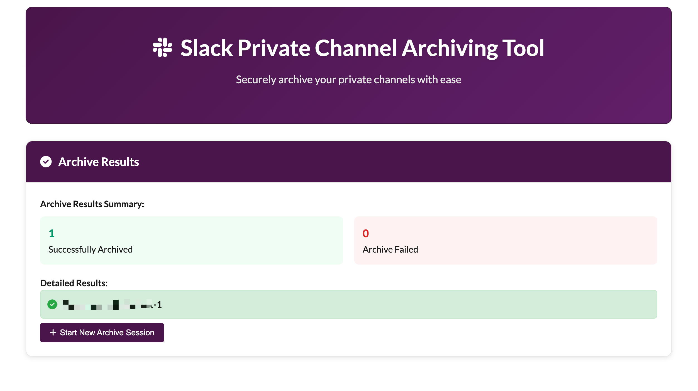

# Slack 私有频道归档工具

<div align="center">

[](README_EN.md)
[](README.md)

</div>

Slack Private Channel 归档工具，帮助用户安全地归档 Slack 私有频道。该工具提供支持 OAuth 授权、频道列表查看、批量选择和归档操作。

## 默认配置说明

**当前默认版本为归档 Private Channel 且列表仅过滤出授权者创建的 channel，具体需要操作私有频道或公共频道，可根据需求自己配置。**

> 💡 **配置提示**：如需修改频道类型或过滤条件，请参考 [配置说明文档](CONFIGURATION.md) 进行自定义设置。

## 功能特性

- 🔐 **安全的 OAuth 授权** - 使用 Slack OAuth 2.0 流程，无需手动输入 token
- 📋 **频道列表管理** - 显示所有私有频道，包含成员数量、创建时间等信息、（可配置 public channel，但日常 public channel 可通过 bot token 进行管理）
- ✅ **批量选择** - 支持全选/取消全选，方便批量操作
- 🗄️ **一键归档** - 安全地归档选中的频道
- 📊 **操作结果反馈** - 详细的成功/失败结果展示
- 🎨 **现代化 UI** - 响应式设计，支持移动端访问
- ⚡ **实时状态** - 显示频道状态（活跃/已归档）

## 页面展示

### 主页面


应用的主页面，提供Slack授权入口和功能介绍。

### 频道列表

显示所有可归档的私有频道，支持批量选择和查看频道详细信息。

### 确认归档

归档操作前的确认页面，显示选中的频道列表供用户最终确认。

### 归档结果

归档操作完成后的结果展示，包含成功/失败统计和详细结果。

## 技术栈

- **后端**: Node.js + Express
- **前端**: 原生 JavaScript + CSS3
- **API**: Slack Web API
- **样式**: 现代化 CSS + Font Awesome 图标

## 环境要求

- **Node.js**: >= 18.17.0
- **npm**: >= 8.0.0

## 安装和配置

### 1. 克隆项目

```bash
git clone <repository-url>
cd slack-archive-tool
```

### 2. 安装依赖

**确保您使用的是支持的 Node.js 版本**：

```bash
# 检查 Node.js 版本
node --version  # 应该显示 v18.17.0 或更高版本

# 安装依赖
npm install
```

### 3. 配置 Slack App

1. 访问 [Slack API 网站](https://api.slack.com/apps)
2. 点击 "Create New App" → "From scratch"
3. 输入应用名称和选择工作区
4. 在 "OAuth & Permissions" 页面配置：
   - **Redirect URLs**: `https://localhost:3000/auth/callback` ⚠️ **必须使用 HTTPS**
   - **Scopes**: 添加以下权限
     - `channels:read` - 读取公开频道信息
     - `groups:read` - 读取私有频道信息
     - `channels:write` - 管理公开频道
     - `groups:write` - 管理私有频道

**重要**: Slack OAuth 2.0 强制要求回调 URL 必须是 HTTPS 协议。

### 4. 配置环境变量

#### 本地开发环境
复制 `env.local.example` 文件为 `.env`：

```bash
cp env.local.example .env
```

#### 生产环境
复制 `env.example` 文件为 `.env`：

```bash
cp env.example .env
```

编辑 `.env` 文件，填入您的 Slack App 配置：

**本地开发配置**：
```env
# Slack App 配置
SLACK_CLIENT_ID=your_slack_client_id
SLACK_CLIENT_SECRET=your_slack_client_secret
SLACK_REDIRECT_URI=https://localhost:3000/auth/callback

# 服务器配置
PORT=3000
NODE_ENV=development
USE_HTTPS=true
```

**生产环境配置**：
```env
# Slack App 配置
SLACK_CLIENT_ID=your_slack_client_id
SLACK_CLIENT_SECRET=your_slack_client_secret
SLACK_REDIRECT_URI=https://your-domain.com/auth/callback

# 服务器配置
PORT=3000
NODE_ENV=production
USE_HTTPS=false
```

**注意**: 
- 本地开发时 `SLACK_REDIRECT_URI` 使用 `https://localhost:3000/auth/callback`
- 生产环境时 `SLACK_REDIRECT_URI` 使用您的实际域名
- `USE_HTTPS` 在本地开发时设为 `true`，生产环境时设为 `false`

### 5. 配置 SSL 证书（仅本地开发需要）

**本地开发环境**：由于 Slack OAuth 2.0 强制要求 HTTPS 回调，您需要生成本地 SSL 证书：

```bash
# 生成自签名证书
openssl req -x509 -newkey rsa:4096 -keyout key.pem -out cert.pem -days 365 -nodes
```

**生产环境**：如果使用 Cloudflare 等代理服务，无需生成本地证书，设置 `USE_HTTPS=false` 即可。

**注意**: 
- 生成的 `key.pem` 和 `cert.pem` 文件已被 `.gitignore` 忽略，不会上传到版本控制
- 本地开发时这是必要步骤，生产环境由代理服务处理 HTTPS

### 6. 启动应用

```bash
# 开发模式（自动重启）
npm run dev

# 生产模式
npm start
```

访问 `https://localhost:3000` 开始使用。

**注意**: 浏览器可能会显示安全警告，因为使用的是自签名证书。点击"高级"→"继续访问"即可。

## 使用说明

### 1. 授权访问
- 点击 "授权 Slack 访问" 按钮
- 在 Slack 授权页面确认权限
- 授权成功后自动返回应用

### 2. 选择频道
- 查看所有私有频道列表
- 使用复选框选择要归档的频道
- 支持全选/取消全选操作
- 可以刷新列表获取最新数据

### 3. 确认归档
- 查看选中的频道列表
- 确认操作（不可逆）
- 点击 "确认归档" 执行操作

### 4. 查看结果
- 显示归档成功/失败统计
- 详细的每个频道操作结果
- 可以开始新的归档会话

## API 端点

### 认证相关
- `GET /auth/slack` - 启动 OAuth 授权流程
- `GET /auth/callback` - OAuth 回调处理

### 频道管理
- `GET /api/channels?token_id=<id>` - 获取私有频道列表
- `POST /api/archive` - 归档选中的频道

## 安全考虑

- 使用 OAuth 2.0 流程，无需存储用户密码
- Token 临时存储，1小时后自动过期
- 定期清理过期的 token
- 所有 API 调用都经过验证

## 开发说明

### 项目结构
```
slack-archive-tool/
├── server.js              # Express HTTPS 服务器
├── package.json           # 项目配置
├── package-lock.json      # 依赖锁定文件
├── .gitignore             # Git 忽略文件
├── env.example            # 环境变量示例
├── env.local.example      # 本地环境变量示例
├── README.md              # 项目说明
├── README_EN.md           # 英文文档
├── QUICKSTART.md          # 快速开始指南
├── QUICKSTART_EN.md       # 英文快速开始指南
├── CONFIGURATION.md       # 配置说明文档
├── DEPLOYMENT.md          # 部署说明
├── LICENSE                # 许可证文件
├── screenshots/           # 页面截图
└── public/                # 静态文件
    ├── index.html         # 主页面
    ├── styles.css         # 样式文件
    └── script.js          # 前端逻辑
```

### 重要文件说明

- **`.env`**: 环境变量文件（不提交到版本控制）
- **`key.pem` & `cert.pem`**: SSL 证书文件（不提交到版本控制）
- **`node_modules/`**: 依赖包目录（不提交到版本控制）

### 自定义配置

#### 修改端口
编辑 `.env` 文件中的 `PORT` 变量。

#### 修改 OAuth 重定向 URL
1. 更新 `.env` 文件中的 `SLACK_REDIRECT_URI`
2. 在 Slack App 设置中更新对应的重定向 URL

#### 自定义样式
编辑 `public/styles.css` 文件来自定义界面样式。

#### 频道类型配置
当前默认配置为仅显示私有频道且仅显示授权者创建的频道。如需调整，可修改 `server.js` 中的相关配置：

**获取频道列表的配置**（第 150-160 行左右）：
```javascript
// 获取私有频道列表
const channelsResponse = await axios.get('https://slack.com/api/conversations.list', {
  headers: {
    'Authorization': `Bearer ${decryptedToken}`
  },
  params: {
    types: 'private_channel',  // 可改为 'public_channel' 或 'private_channel,public_channel'
    exclude_archived: true
  }
});

// 过滤频道（第 170-175 行左右）
const filteredChannels = channelsResponse.data.channels.filter(channel => {
  return channel.creator === currentUserId;  // 移除此条件可显示所有频道
});
```

**配置选项说明**：
- `types: 'private_channel'` - 仅私有频道
- `types: 'public_channel'` - 仅公共频道  
- `types: 'private_channel,public_channel'` - 私有和公共频道
- `channel.creator === currentUserId` - 仅显示当前用户创建的频道
- 移除过滤条件 - 显示所有频道

## 故障排除

### 常见问题

1. **Node.js 版本问题**
   - 确保使用 Node.js 18.17.0 或更高版本
   - 如果遇到 npm 语法错误，请升级 Node.js 版本
   - 使用 `node --version` 检查当前版本

2. **OAuth 授权失败**
   - 检查 Slack App 配置是否正确
   - 确认重定向 URL 匹配
   - 验证 Client ID 和 Secret

3. **无法获取频道列表**
   - 确认 App 有正确的权限范围
   - 检查用户是否有访问私有频道的权限

4. **归档操作失败**
   - 确认用户有归档频道的权限
   - 检查频道是否已经被归档

### 调试模式

启动时添加调试信息：

```bash
DEBUG=* npm start
```

## 许可证

MIT License